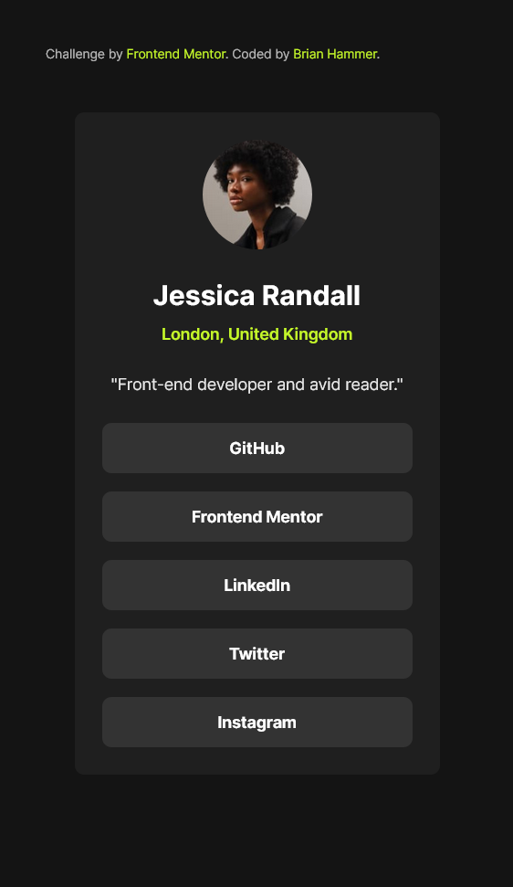

# Frontend Mentor - Social links profile solution

This is a solution to the [Social links profile challenge on Frontend Mentor](https://www.frontendmentor.io/challenges/social-links-profile-UG32l9m6dQ). Frontend Mentor challenges help you improve your coding skills by building realistic projects.

## Table of contents

- [Overview](#overview)
  - [The challenge](#the-challenge)
  - [Screenshot](#screenshot)
  - [Links](#links)
  - [Built with](#built-with)
- [Author](#author)

**Note: Delete this note and update the table of contents based on what sections you keep.**

## Overview

A social media component built using tailwindcss.

### The challenge

Users should be able to:

- See hover and focus states for all interactive elements on the page

### Screenshot

### Links

- Solution URL: [https://github.com/BrianHammer/social-links](https://github.com/BrianHammer/social-links)
- Live Site URL: [https://brianhammer.github.io/social-links/](https://brianhammer.github.io/social-links/)

### Built with

- HTML5
- Tailwind css
- Tailwind transition classes

## Author

- Frontend Mentor - [@BrianHammer](https://www.frontendmentor.io/profile/BrianHammer)
